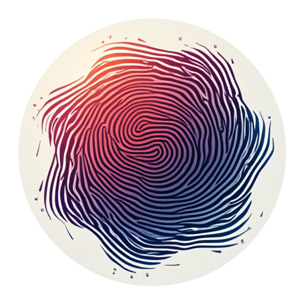

<a href="https://music.standen.link">
  
</a>

# Glicol Music

Generative music created with [Glicol](https://glicol.org).

🎵 Live at [music.standen.link](https://music.standen.link).

## Installation

[Install Bun](https://bun.sh/docs/installation).

Install the dependencies:

```bash
bun install
```

## Usage

Run the app:

```bash
bun run dev
```

## License

> [!IMPORTANT]
> Want to use this music in your own project?
> It's free!
> Please remember to respect the license by giving credit to [Michael Standen](https://michael.standen.link).

All glicol music files are located in the `public/music` folder.

This project is licensed under the MIT License - see the [LICENSE](LICENSE) file for details.
